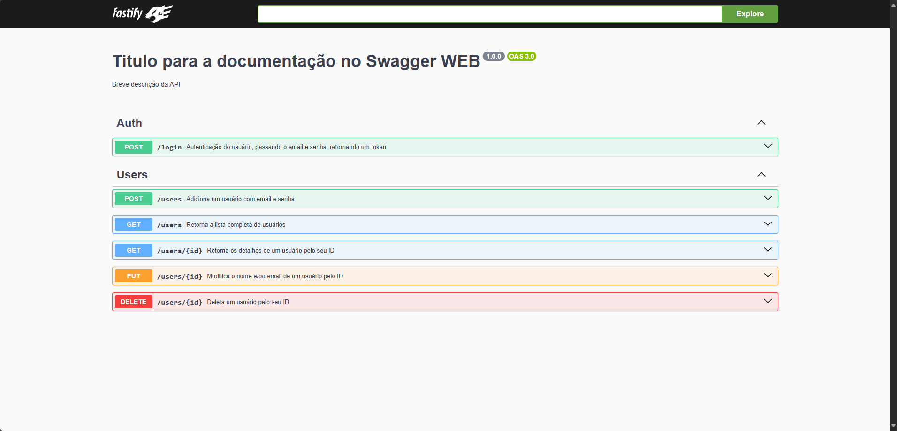

# SDK API RESTFUL 

## OBJETIVO
A fim de facilitar o desenvolvimento de APIs, foi criado um SDK (kit de desenvolvimento de software) para minhas API's, o Swagger juntamente com os Schemas do Prisma fazem com que a documentação seja feita de forma automática, facilitando a vida do desenvolvedor e de quem for usar a API.

## INTRODUÇÃO
Este repositório tem como objetivo demonstrar a criação de uma API RESTFUL utilizando as tecnologias:
- FASTIFY
- SWAGGER
- PRISMA
- LOGS
- MODELO MVC
- SCHEMAS
- AUTH
- MIDDLEWARES

## Como usar o SDK?

Clone o repositório: `git clone https://github.com/rafaelRizzo/api-sdk`

Depois instale os pacotes: `npm install`

### Configure o .env
***

### Configurando o Prisma ORM
O Prisma é um ORM que permite a criação de APIs de forma rápida e segura, é um "Orquestrador de Banco de dados", além de fácil migração entre DB's, nesse por exemplo estou usando o Postgresql mas você pode configurar a string de conexão de um MYSQL normalmente!

Para Iniciar o prisma siga os passos abaixo:

Execute: `npx prisma generate`

Execute: `npx prisma db push` (Cuidado ao utilizar esse comando pois irá criar as tabelas no seu banco de dados de acordo com que está no SCHEMA do prisma)

Feito isso basta iniciar o projeto com o comando: `npm run dev`

E acessar a documentação da API em: `http://localhost:3000/docs`

## MAPEAMENTO DOS ERROS DO PRISMA CLIENT
| Código  | Nome                        | Explicação                                                                                                |
| ------- | --------------------------- | --------------------------------------------------------------------------------------------------------- |
| `P1000` | AuthenticationFailed        | Falha na autenticação com o banco de dados. Usuário ou senha errados.                                     |
| `P1001` | DatabaseNotReachable        | Prisma não conseguiu se conectar ao banco de dados. Verifique a URL e se o banco está rodando.            |
| `P1002` | Timeout                     | A conexão com o banco de dados expirou após um tempo limite. Pode ser firewall ou rede lenta.             |
| `P1003` | DatabaseVersionNotSupported | A versão do banco de dados não é compatível com o Prisma Client.                                          |
| `P1008` | OperationTimedOut           | Uma query levou muito tempo para executar e Prisma cancelou. Pode ser índice ou timeout baixo.            |
| `P1010` | UserAccessDenied            | Permissão negada no banco de dados. O usuário não tem acesso necessário.                                  |
| `P1011` | TLSConnectionError          | Erro ao estabelecer conexão TLS (certificados ou configurações de SSL).                                   |
| `P1017` | ServerClosedConnection      | O servidor de banco de dados fechou a conexão inesperadamente.                                            |
| `P2000` | ValueTooLong                | Um valor passado é maior do que o permitido pela coluna do banco de dados.                                |
| `P2001` | RecordNotFound              | Nenhum registro foi encontrado com a condição passada.                                                    |
| `P2002` | UniqueConstraintFailed      | Um valor duplicado foi passado para uma coluna `@unique`.                                                 |
| `P2003` | ForeignKeyConstraintFailed  | Violação de chave estrangeira ao tentar inserir ou atualizar dados.                                       |
| `P2004` | ConstraintViolation         | Violação genérica de alguma restrição do banco de dados.                                                  |
| `P2005` | InvalidValueForFieldType    | Valor incompatível com o tipo definido no schema Prisma.                                                  |
| `P2006` | InvalidFieldValue           | Valor inválido fornecido para algum campo.                                                                |
| `P2007` | DataValidationError         | Erro de validação de dados no Prisma Client.                                                              |
| `P2008` | QueryParsingError           | Erro ao interpretar a query enviada para o banco.                                                         |
| `P2009` | QueryValidationError        | Query inválida em termos de sintaxe ou estrutura.                                                         |
| `P2010` | RawQueryFailed              | Query crua (`queryRaw`) falhou ao ser executada.                                                          |
| `P2011` | NullConstraintViolation     | Campo `@notNull` recebeu `null`.                                                                          |
| `P2012` | MissingRequiredValue        | Valor obrigatório (`@required`) não foi fornecido.                                                        |
| `P2013` | MissingArgument             | Faltou argumento obrigatório na chamada de uma função do Prisma Client.                                   |
| `P2025` | RecordNotFound              | Nenhum registro foi encontrado para uma operação onde era obrigatório achar algo (como update ou delete). |
| `P2026` | NotImplemented              | Alguma funcionalidade não foi implementada para o banco atual.                                            |
